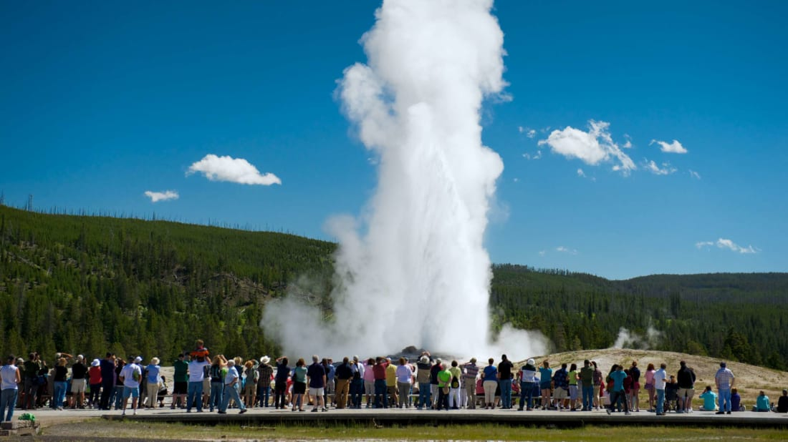
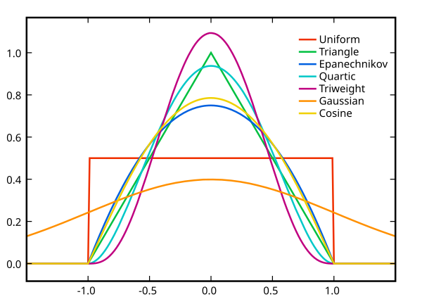

```{r setup, include=FALSE}
knitr::opts_chunk$set(fig.align = 'center', cache = FALSE)
```

Display system information and load `tidyverse` and `faraway` packages
```{r}
sessionInfo()
library(tidyverse)
library(faraway)
```

## Parametric vs nonparametric models

- Given a regressor/predictor $x_1,\ldots,x_n$ and response $y_1, \ldots, y_n$, where
$$
y_i = f(x_i) + \epsilon_i,
$$
where $\epsilon_i$ are iid with mean zero and unknown variance $\sigma^2$. 

- **Parametric approach** assumes that $f(x)$ belongs to a parametric family $f(x \mid \boldsymbol{\beta})$. Examples are
\begin{eqnarray*}
  f(x \mid \boldsymbol{\beta}) &=& \beta_0 + \beta_1 x \\
  f(x \mid \boldsymbol{\beta}) &=& \beta_0 + \beta_1 x + \beta_2 x^2 \\
  f(x \mid \boldsymbol{\beta}) &=& \beta_0 + \beta_1 x^{\beta_2}.
\end{eqnarray*}

- **Nonparametric approach** assumes $f$ is from some smooth family of functions. 

- Nonparametric approaches offer flexible modelling of complex data, and often serve as valuable exploratory data analysis tools to guide formulation of meaningful and effective parametric models.

- Three running examples.

- `exa`: $f(x) = \sin^3 (2 \pi x^3)$. 
```{r}
    exa <- as_tibble(exa) %>% print()
    exa %>%
      ggplot(mapping = aes(x = x, y = y)) + 
      geom_point() +
      geom_smooth(span = 0.2) + # small span give more wiggleness
      geom_line(mapping = aes(x = x, y = m)) # true model (black line)
```

- `exb`: $f(x) = 0$. 
```{r}
    exb <- as_tibble(exb) %>% print()
    exb %>%
      ggplot(mapping = aes(x = x, y = y)) + 
      geom_point() +
      geom_smooth() +
      geom_line(mapping = aes(x = x, y = m))
```

- `faithful`: data on Old Faithful geyser in Yellowstone National Park.
```{r}
    faithful <- as_tibble(faithful) %>% print()
    faithful %>%
      ggplot(mapping = aes(x = eruptions, y = waiting)) + 
      geom_point() +
      geom_smooth() # small span give more wiggleness
```




## Kernel estimators

- [A conversation with Geoff Watson](https://projecteuclid.org/journals/statistical-science/volume-13/issue-1/A-conversation-with-Geoff-Watson/10.1214/ss/1028905975.full)

- Moving average estimator
$$
\hat f_\lambda(x) = \frac{1}{n\lambda} \sum_{j=1}^n K\left( \frac{x-x_j}{\lambda} \right) Y_j = \frac{1}{n} \sum_{j=1}^n w_j Y_j,
$$
where
$$
w_j = \lambda^{-1} K\left( \frac{x-x_j}{\lambda} \right),
$$
and $K$ is a **kernel** such that $\int K(x) \, dx = 1$. $\lambda$ is called the **bandwidth**, **window width** or **smoothing parameter**.

- When $x$s are spaced unevenly, the kernel estimator can give poor results. This is improved by the **Nadaraya-Watson** estimator
$$
f_\lambda(x) = \frac{\sum_{j=1}^n w_j Y_j}{\sum_{j=1}^n w_j}.
$$
- Asymptotics of kernel estimators 
$$
\text{MSE}(x) = \mathbb{E} [f(x) - \hat f_\lambda(x)]^2 = O(n^{-4/5}).
$$
Typical parametric estimator has $\text{MSE}(x) = O(n^{-1})$ _if the parametric model is correct_. 

- Choice of kernel. Ideal kernel is smooth, compact, and amenable to rapid computation. The optimal choice under some standard assumptions is the **Epanechnikov kernel**
$$
K(x) = \begin{cases}
\frac 34 (1 - x^2) & |x| < 1 \\
0 & \text{otherwise}
\end{cases}.
$$

 


- Choice of smoothing parameter $\lambda$. Small $\lambda$ gives more wiggly curves, while large $\lambda$ yields smoother curves. 

```{r}
for (bw in c(0.1, 0.5, 2)) {
  with(faithful, {
    plot(waiting ~ eruptions, col = gray(0.75))
    # Nadaraya–Watson kernel estimate with normal kernel
    lines(ksmooth(eruptions, waiting, "normal", bw))
  })
}
```

- Cross-validation (CV) choose the $\lambda$ that minimizes the criterion
$$
\text{CV}(\lambda) = \frac 1n \sum_{j=1}^n [y_j - \hat f_{\lambda(j)}(x_j)]^2,
$$
where $(j)$ indicates that point $j$ is left out of the fit. 

```{r}
library(sm)

with(faithful,
     sm.regression(eruptions, waiting, h = h.select(eruptions, waiting)))
with(exa, sm.regression(x, y, h = h.select(x, y)))
with(exb, sm.regression(x, y, h = h.select(x, y)))
```

## Splines

- [A Conversation with Grace Wahba](https://projecteuclid.org/journals/statistical-science/volume-13/issue-1/A-conversation-with-David-Ruppert/10.1214/ss/1028905976.full)

### Why Splines?

- Kernel smoothers and local averaging are intuitive, but they can be hard to write as familiar regression models.

- Splines keep the flexibility of nonparametric regression while using the familiar linear-model form
$$
\hat f(x) = \sum_{m=1}^M \hat\beta_m h_m(x).
$$

- Once the basis functions $h_m$ are chosen, estimation is ordinary least squares or penalized least squares.

- Main teaching question: **where does smoothness come from?**

### Piecewise Polynomials

- Instead of using one polynomial over the whole range of $x$, fit different polynomials in regions separated by **knots**.

- For example, a piecewise cubic polynomial with one knot at $c$ takes the form
$$
y_i =
\begin{cases}
\beta_{01} + \beta_{11}x_i + \beta_{21}x_i^2 + \beta_{31}x_i^3 + \epsilon_i, & x_i < c, \\
\beta_{02} + \beta_{12}x_i + \beta_{22}x_i^2 + \beta_{32}x_i^3 + \epsilon_i, & x_i \geq c.
\end{cases}
$$

- Without constraints, the fitted curve can jump or bend sharply at the knots.

- Splines add continuity constraints. Cubic splines are continuous and have continuous first and second derivatives.

<p align="center">
{width=600px height=600px}
</p>

### Linear Splines

- A **linear spline** with knots at $\xi_k$, $k = 1,\ldots,K$, is a piecewise linear function that is continuous at each knot.

- A convenient basis is
$$
y_i = \beta_0 + \beta_1 x_i + \sum_{k=1}^K \beta_{k+1}(x_i-\xi_k)_+ + \epsilon_i,
$$
where
$$
(x_i-\xi_k)_+ =
\begin{cases}
x_i-\xi_k, & x_i > \xi_k, \\
0, & \text{otherwise}.
\end{cases}
$$

```{r}
# right hockey stick function (RHS) with a knot at c
rhs <- function(x, c) ifelse(x > c, x - c, 0)
curve(rhs(x, 0.5), 0, 1)
```

- The basis functions look like "hinges"; each knot allows the slope to change after that point.

```{r}
(knots <- 0:9 / 10)
dm <- outer(exa$x, knots, rhs)
dim(dm)
matplot(exa$x, dm, type = "l", col = 1, xlab = "x", ylab="")
```

### Regression Splines

- A **regression spline** uses a relatively small set of knots, then estimates the basis coefficients by regression.

- With fixed knots, spline fitting is just linear regression on the constructed basis functions.

```{r}
lmod <- lm(exa$y ~ dm)
plot(y ~ x, exa, col = gray(0.75))
lines(m ~ x, exa)
lines(exa$x, predict(lmod), lty = 2)
```

- Better knot placement can improve the fit: use more knots where the function has more curvature.

```{r}
newknots <- c(0, 0.5, 0.6, 0.65, 0.7, 0.75, 0.8, 0.85, 0.9, 0.95)
dmn <- outer(exa$x, newknots, rhs)
lmod <- lm(exa$y ~ dmn)
plot(y ~ x, data = exa, col = gray(0.75))
lines(m ~ x, exa)
lines(exa$x, predict(lmod), lty = 2)
```

### Cubic Splines and B-Splines

- A **cubic spline** with knots at $\xi_k$, $k = 1,\ldots,K$, is a piecewise cubic polynomial with continuous derivatives up to order 2 at each knot.

- One basis is the truncated power basis:
$$
1,\ x,\ x^2,\ x^3,\ (x-\xi_1)_+^3,\ldots,(x-\xi_K)_+^3.
$$

- The truncated power basis is conceptually simple, but can be numerically unstable. In practice, software usually uses **B-splines**, which are stable and locally supported.

```{r}
library(splines)

matplot(bs(seq(0, 1, length = 1000), df = 12), type = "l", ylab="", col = 1)
```

```{r}
# generate design matrix using B-splines with df = 12
lmod <- lm(y ~ bs(x, df = 12), exa)
plot(y ~ x, exa, col = gray(0.75))
lines(m ~ x, exa) # true model
lines(predict(lmod) ~ x, exa, lty = 2) # Cubic B-spline fit
```

### Natural Cubic Splines

- Regular splines can have high variance near the boundary of the observed $x$ range.

- A **natural cubic spline** is constrained to be linear beyond the boundary knots.

- This reduces unstable tail behavior while allowing flexible curvature in the middle of the data.

```{r}
lmod_bs <- lm(y ~ bs(x, df = 12), exa)
lmod_ns <- lm(y ~ ns(x, df = 12), exa)

plot(y ~ x, exa, col = gray(0.75))
lines(m ~ x, exa)
lines(predict(lmod_bs) ~ x, exa, lty = 2)
lines(predict(lmod_ns) ~ x, exa, lty = 5, lwd = 2)
legend(
  "topleft",
  legend = c("truth", "B-spline", "natural spline"),
  lty = c(1, 2, 5),
  lwd = c(1, 1, 2),
  bty = "n"
)
```

- In practice, users often specify the degrees of freedom and let software choose knot number and placement.

### Smoothing Splines

- A smoothing spline chooses $\hat f$ to minimize the penalized least-squares criterion
$$
\frac 1n \sum_i [y_i - f(x_i)]^2 + \lambda \int [f''(x)]^2 \, dx,
$$
where $\lambda > 0$ is the **smoothing parameter** and $\int [f''(x)]^2 \, dx$ is a **roughness penalty**.

- Large $\lambda$ gives a smoother curve; small $\lambda$ gives a more flexible curve.

- As $\lambda \to \infty$, the fit approaches a straight line. When $\lambda = 0$, the fit interpolates the data.

- The minimizer is a natural cubic spline with knots at the unique observed $x_i$ values.

### Effective Degrees of Freedom

- The fitted values can be written as
$$
\hat{\mathbf f}_\lambda = S_\lambda \mathbf y,
$$
where $S_\lambda$ is the smoothing matrix.

- The **effective degrees of freedom** are
$$
\mathrm{df}_\lambda = \sum_i S_{\lambda, ii}.
$$

- This lets software report or tune smoothing splines using `df`, even though the optimization is controlled by $\lambda$.

- Leave-one-out cross-validation can be computed efficiently as
$$
\text{CV}(\lambda)
= \sum_{i=1}^n
\left[
\frac{y_i - \hat f_\lambda(x_i)}{1 - S_{\lambda, ii}}
\right]^2.
$$

### Smoothing Spline Examples

```{r}
with(faithful, {
  plot(waiting ~ eruptions, col = gray(0.75))
  lines(smooth.spline(eruptions, waiting), lty = 2, lwd = 2)
})
```

```{r}
with(exa, {
  plot(y ~ x, col = gray(0.75))
  lines(x, m) # true model
  lines(smooth.spline(x, y, df = 16), lty = 2)
  lines(smooth.spline(x, y, cv = TRUE), lty = 5, lwd = 2)
})
```

```{r}
with(exb, {
  plot(y ~ x, col = gray(0.75))
  lines(x, m) # true model
  lines(smooth.spline(x, y), lty = 2)
})
```

- The `exb` example is useful pedagogically: automatic tuning is helpful, but it is not foolproof.

### Regression vs Smoothing Splines

- **Regression splines**: choose a smaller set of knots; fit by regression on spline basis functions.

- **Smoothing splines**: use knots at all unique observed $x_i$ values; control wiggliness with a penalty.

- Same family of smooth functions, different strategy for controlling complexity.

## Local Polynomial Regression

<p align="center">
{width=600px height=600px}
</p>

- Both kernel and spline smoothers are vulnerable to outliers.

- **Local polynomial** methods fit a polynomial in a moving window, then use the fitted value at the center of the window as the estimate. This procedure is repeated over the range of the data. 

- **lowess** (locally weighted scatterplot smoothing) or **loess** (locally estimated scatterplot smoothing) functions in R.

- We choose the polynomial order and window width. In R, `loess()` defaults to a quadratic local fit with span 0.75. 

- Examples.

```{r}
with(faithful, {
  plot(waiting ~ eruptions, col = gray(0.75))
  f <- loess(waiting ~ eruptions)
  i <- order(eruptions)
  lines(f$x[i], f$fitted[i])
})
```

```{r}
with(exa, {
  plot(y ~ x, col = gray(0.75))
  lines(m ~ x)
  f <- loess(y ~ x) # default span = 0.75
  lines(f$x, f$fitted, lty = 2)
  # try smaller span (proportion of the range)
  f <- loess(y ~ x, span = 0.22)
  lines(f$x, f$fitted, lty = 5)
})
```

```{r}
with(exb, {
  plot(y ~ x, col = gray(0.75))
  lines(m ~ x) 
  f <- loess(y ~ x) # default span = 0.75
  lines(f$x, f$fitted, lty = 2)
  # span = 1 means whole span of data (smoothest)
  f <- loess(y ~ x, span = 1)
  lines(f$x, f$fitted, lty = 5)
})
```

- Pointwise confidence band is obtained by the local parametric fit for smoothing splines or loess.

```{r}
ggplot(data = exa, mapping = aes(x = x, y = y)) +
  geom_point(alpha = 0.25) + 
  geom_smooth(method = "loess", span = 0.22) + 
  geom_line(mapping = aes(x = x, y = m), linetype = 2)
```

- Simultaneous confidence band can be constructed by the `mgcv` package.

```{r}
library(mgcv)

ggplot(data = exa, mapping = aes(x = x, y = y)) +
  geom_point(alpha = 0.25) + 
  geom_smooth(method = "gam", span = 0.22, formula = y ~ s(x, k = 20)) + 
  geom_line(mapping = aes(x = x, y = m), linetype = 2)
```

## Takeaways

- Nonparametric regression trades a strict parametric form for a smoothness assumption.

- Kernel methods average nearby observations; the bandwidth controls smoothness.

- Regression splines use a small basis expansion and fit by ordinary regression.

- Smoothing splines use many knots but penalize curvature; $\lambda$ or effective degrees of freedom controls smoothness.

- Local polynomial regression fits simple models locally; the span controls how local the fit is.

- In applied work, the most important habit is to vary the smoothness and check whether the substantive story changes.

## Optional: Wavelets

- In general, we approximate a curve by a family of basis functions
$$
\hat f(x) = \sum_i c_i \phi_i(x),
$$
where the basis functions $\phi_i$ are given and the coefficients $c_i$ are estimated. 

- Ideally we would like the basis functions $\phi_i$ to be compactly supported, so they adapt to local features, and orthogonal, so computation is fast. 

- Orthogonal polynomials and Fourier basis are not compactly supported. 

- Cubic B-splines are compactly supported but not orthogonal. 

- **Wavelets** can be both compactly supported and orthogonal. 

- **Haar basis**. The mother wavelet function on [0, 1]
$$
w(x) = \begin{cases}
1 & x \le 1/2 \\
-1 & x > 1/2
\end{cases}.
$$
Next two members are defined on [0, 1/2) and [1/2, 1) by rescaling the mother wavelet to these two intervals. In general, at level $j$
$$
h_n(x) = 2^{j/2} w(2^j x - k),
$$
where $n = 2^j + k$ and $0 \le k \le 2^j$. 
