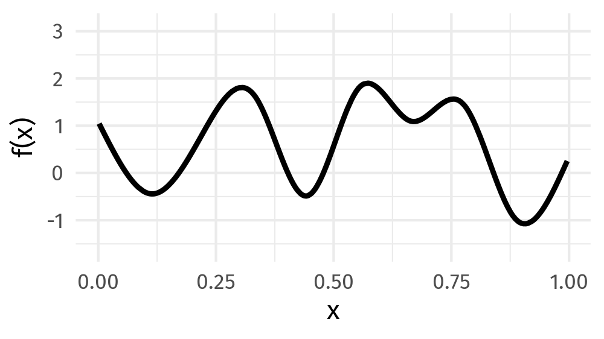
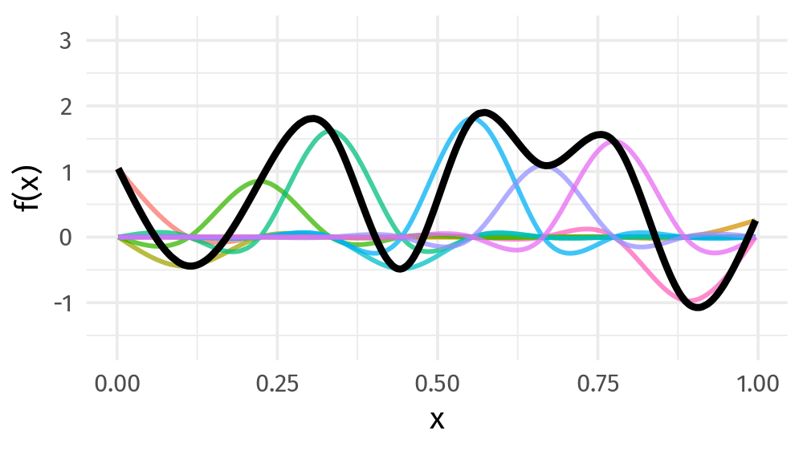
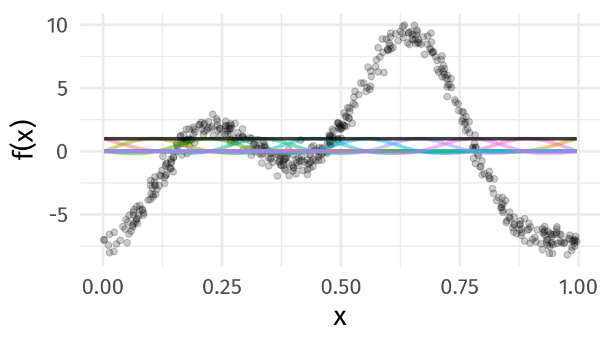

```{r setup, include=FALSE}
knitr::opts_chunk$set(fig.align = 'center', cache = FALSE)
```

Display system information and load `tidyverse`, `faraway`, and `mgcv` packages.

```{r}
sessionInfo()
library(tidyverse)
library(faraway)
library(mgcv)
```

## Additional materials about GAM

- [Generalized Additive Models, An Introduction with R, Second Edition](https://www.routledge.com/Generalized-Additive-Models-An-Introduction-with-R-Second-Edition/Wood/p/book/9781498728331) by Simon Wood

- Introduction to Generalized Additive Models with R and mgcv [Git](https://github.com/gavinsimpson/intro-gam-webinar-2020), [Youtube](https://www.youtube.com/watch?v=sgw4cu8hrZM&t=970s)

## Additive models

- For $p$ predictors $x_1, \ldots, x_p$, nonparametric regression takes the form
$$
y = f(x_1, \ldots, x_p) + \epsilon.
$$
For $p$ larger than two or three, it becomes impractical to fit such models due to large sample size requirements. This is sometimes called the **curse of dimensionality**.

- A simplified model is the **additive model**
$$
y = \beta_0 + \sum_{j=1}^p f_j(x_j) + \epsilon,
$$
where $f_j$ are smooth functions. Interaction terms are ignored. To incorporate categorical predictors, we can use the model
$$
y = \beta_0 + \sum_{j=1}^p f_j(x_j) + \mathbf{z}^T \boldsymbol{\gamma} + \epsilon,
$$
where $\mathbf{z}$ are categorical predictors.

- The generalized additive model (GAM) replaces the mean model in a GLM by an additive predictor:
$$
g(\mu_i) = \eta_i = \beta_0 + \sum_{j=1}^p f_j(x_{ij}) + \mathbf{z}_i^T \boldsymbol{\gamma}.
$$


- There are several packages in R that can fit additive models: `gam`, `mgcv` (included in the default installation of R), and `gss`.

## Estimation procedures: what is being estimated?

There are two estimation problems in a GAM:

1. Estimate the coefficients that define each smooth curve.
2. Estimate how smooth each curve should be.

For a single smooth term, we write
$$
f(x) = \sum_{k=1}^K \beta_k b_k(x),
$$
where $b_k(x)$ are basis functions. Therefore, estimating a curve becomes estimating many coefficients $\beta_k$.

The basis dimension $K$ controls the largest space of functions we allow. The smoothing parameter controls how much wiggliness is allowed inside that space.


### Visualizing basis functions

The next two animations are useful for slowing down the idea that a smooth curve is built from simpler pieces.

First, many possible smooth curves can be formed from the same family of basis functions by changing the coefficients.

{fig-align="center" width="85%"}

Second, each basis function receives a coefficient. The fitted smooth is the sum of the weighted basis functions.

{fig-align="center" width="85%"}

### What kind of smooth is `s(x)`?

In `mgcv`, writing
```{r, eval=FALSE}
s(x)
```
does not mean "use any arbitrary curve." It means:

1. choose a spline basis for representing the curve;
2. choose a penalty that measures wiggliness;
3. estimate the basis coefficients;
4. estimate the smoothing parameter.

The default smooth in `mgcv` is a **thin plate regression spline**:
```{r, eval=FALSE}
s(x, bs = "tp")
```

This is the default because it usually works well without requiring the user to manually choose knot locations.

Other useful smooth bases include:

- `bs = "tp"`: thin plate regression spline; the default general-purpose smooth.
- `bs = "cr"`: cubic regression spline; useful for visualizing basis functions and spline construction.
- `bs = "ps"`: P-spline; B-spline basis with a difference penalty on coefficients.
- `bs = "cc"`: cyclic cubic spline; useful for periodic variables such as day of year.
- `bs = "re"`: random-effect smooth; useful for simple random intercepts or random effects.

For example:
```{r, eval=FALSE}
gam(y ~ s(x, bs = "tp"), data = dat, method = "REML")
gam(y ~ s(x, bs = "cr"), data = dat, method = "REML")
gam(y ~ s(day, bs = "cc"), data = dat, method = "REML")
```

For interactions, `mgcv` provides tensor product smooths:
```{r, eval=FALSE}
te(x, z)
```

These are useful when two variables are measured on different scales, such as temperature and inversion base height.


### Identifiability of additive smooths

In an additive model,
$$
y_i = \beta_0 + f_1(x_{i1}) + f_2(x_{i2}) + \epsilon_i,
$$
the decomposition is not unique unless we constrain the smooths. For example, adding a constant to $f_1$ and subtracting it from the intercept gives the same fitted values.

A common centering constraint is
$$
\sum_{i=1}^n f_j(x_{ij}) = 0.
$$

Then $\beta_0$ represents the average fitted response on the link scale, and each $f_j$ is interpreted as a centered partial effect.

## Estimation I: backfitting

The `gam` package is historically associated with a **backfitting algorithm** for fitting additive models.

Suppose
$$
y_i = \beta_0 + f_1(x_{i1}) + f_2(x_{i2}) + \epsilon_i.
$$

If $f_2$ were known, then $f_1$ could be estimated by smoothing the partial residual
$$
r_{i1} = y_i - \beta_0 - f_2(x_{i2})
$$
against $x_{i1}$.

Similarly, if $f_1$ were known, then $f_2$ could be estimated by smoothing
$$
r_{i2} = y_i - \beta_0 - f_1(x_{i1})
$$
against $x_{i2}$.

Backfitting alternates these two steps.

1. Initialize $\beta_0 = \bar y$ and initialize each $f_j$.
2. For $j = 1,\ldots,p$, compute the partial residual
$$
r_{ij} = y_i - \beta_0 - \sum_{l \ne j} f_l(x_{il}).
$$
3. Smooth $r_{ij}$ against $x_{ij}$:
$$
f_j \leftarrow S_j(x_j, r_j),
$$
where $S_j$ is a smoother such as a spline or loess smoother.
4. Center the updated $f_j$ so that $\sum_i f_j(x_{ij}) = 0$.
5. Repeat until the fitted functions stop changing.

For non-Gaussian responses, this idea can be combined with the GLM iterative weighted least squares algorithm. At each outer GLM step, we construct a working response and then fit an additive model to that working response.

### Does backfitting need penalization?

Yes, backfitting still needs proper smoothing. The smoothing is hidden inside the operator $S_j$.

Backfitting is an algorithm for cycling through the predictors. It does not, by itself, decide how wiggly each $f_j$ should be. That decision is made by the smoother used in each update:
$$
f_j \leftarrow S_j(x_j, r_j).
$$

For example:

- If $S_j$ is loess, the span controls smoothness.
- If $S_j$ is a smoothing spline, a smoothing parameter controls smoothness.
- If $S_j$ is a regression spline with fixed degrees of freedom, the chosen degrees of freedom control smoothness.

So backfitting does not avoid the smoothing problem. It separates the problem into two parts:

1. use backfitting to update one partial effect at a time;
2. use a chosen smoother $S_j$ to control the complexity of each update.

The modern `mgcv` approach makes this more explicit. It represents each smooth using a basis, penalizes wiggliness, and estimates the smoothing parameters from the data, usually by REML.


## Estimation II: penalized regression splines

The `mgcv` package uses a penalized regression spline approach. Suppose
$$
f_j(x) = \sum_{k=1}^{K_j} \beta_{jk} b_{jk}(x)
$$
for a family of spline basis functions $b_{jk}$. A curve that is too wiggly can overfit the data, so we penalize wiggliness.

For a Gaussian additive model, the basic criterion is
$$
\sum_{i=1}^n (y_i - \eta_i)^2
+ \sum_j \lambda_j \boldsymbol{\beta}_j^T \mathbf{S}_j \boldsymbol{\beta}_j.
$$

Equivalently, `mgcv` maximizes the penalized log-likelihood
$$
\log L(\boldsymbol{\beta})
- \frac{1}{2}\sum_j \lambda_j \boldsymbol{\beta}_j^T \mathbf{S}_j \boldsymbol{\beta}_j.
$$

Here:

- $\mathbf{S}_j$ is a penalty matrix determined by the basis.
- $\boldsymbol{\beta}_j^T \mathbf{S}_j \boldsymbol{\beta}_j$ measures wiggliness.
- $\lambda_j$ is the smoothing parameter for the $j$th smooth.

Small $\lambda_j$ gives a flexible curve. Large $\lambda_j$ gives a smoother, flatter curve.

The following animation shows the same idea in the setting of a cubic regression spline: the curve is flexible enough to follow the data, but the penalty discourages unnecessary wiggle.

{fig-align="center" width="85%"}

### Basis size, smoothing parameter, and EDF

It is useful to separate three related quantities:

- `k`: the basis dimension, or the maximum allowed complexity of the smooth.
- $\lambda$: the smoothing parameter, or the strength of the wiggliness penalty.
- EDF: the effective degrees of freedom, or the amount of complexity actually used.

The effective degrees of freedom can be understood through the hat matrix. For a linear smoother,
$$
\hat{\mathbf{y}} = \mathbf{H}\mathbf{y},
$$
and
$$
\operatorname{EDF} = \operatorname{trace}(\mathbf{H}).
$$

An EDF near 1 means the fitted smooth is close to linear. Larger EDF means the fitted smooth is using more flexibility.


## Why REML appears: connection to mixed models

The connection to linear mixed models can feel mysterious, but the main idea is simple:

> A spline penalty and a normal random-effect distribution both discourage large coefficients.

Write a smooth as two pieces:
$$
f(x) = X_f \alpha + Z u.
$$

Here:

- $X_f\alpha$ is the unpenalized simple part, such as a constant or linear component.
- $Zu$ is the penalized wiggly part.

The penalized least squares criterion has the form
$$
\frac{1}{\sigma^2}\|y - X_f\alpha - Zu\|^2
+ \lambda u^T u.
$$

Now compare this with a linear mixed model:
$$
y = X_f\alpha + Zu + \epsilon,
$$
where
$$
\epsilon \sim N(0,\sigma^2 I),
\qquad
u \sim N(0,\sigma_u^2 I).
$$

The joint negative log-likelihood contains
$$
\frac{1}{\sigma^2}\|y - X_f\alpha - Zu\|^2
+ \frac{1}{\sigma_u^2}u^T u.
$$

After matching scales, the spline smoothing parameter is an inverse variance component:
$$
\lambda = \frac{\sigma^2}{\sigma_u^2}.
$$

Large $\lambda$ corresponds to small $\sigma_u^2$, so the wiggly coefficients are forced close to zero. The fitted curve becomes smooth.

Small $\lambda$ corresponds to large $\sigma_u^2$, so the wiggly coefficients can vary. The fitted curve can be more flexible.


## Smoothing parameter selection: REML vs GCV

The smoothing parameters $\lambda_j$ must be chosen from the data.

### GCV

Generalized cross-validation (GCV) chooses smoothness by approximating prediction error. A simplified version is
$$
\operatorname{GCV}
=
\frac{n \cdot \text{lack of fit}}
{(n - \operatorname{EDF})^2}.
$$

GCV tries to balance fit and complexity. It was widely used in earlier GAM software and is the historical default in many examples.

### REML

Restricted maximum likelihood (REML) uses the mixed-model interpretation. Since the smoothing parameter behaves like an inverse variance component, REML estimates the amount of wiggle as a variance component.

In practice, REML is often more stable than GCV and is less prone to choosing overly wiggly smooths.

In this lecture, we use
```{r, eval=FALSE}
gam(..., method = "REML")
```
as the default fitting strategy.


Practical rule: use REML for estimating smoothness within a chosen GAM. Be cautious about comparing REML scores across models with different fixed-effect structures.


## Choosing the basis dimension `k`

The basis dimension `k` should be large enough that the true smooth function can be represented reasonably well. But `k` does not have to be exactly right, because the smoothing penalty controls the final complexity.

A practical workflow:

1. Start with a moderate or generous `k`.
2. Fit the model using `method = "REML"`.
3. Check whether the EDF is close to the maximum allowed EDF.
4. Use `gam.check()` or `k.check()` to check whether `k` may be too small.
5. If needed, increase `k` and refit.


If the EDF is close to the maximum possible EDF and the `k` diagnostic suggests low p-values, the basis may be too small.


## Simple inference in GAMs

GAM inference is useful, but it is approximate.

Common inferential tasks:

- Test whether a smooth term contributes to the model.
- Test whether a nonlinear smooth is needed instead of a linear term.
- Plot estimated smooths with uncertainty bands.
- Predict the response at new covariate values.

Important cautions:

- Smooth-term p-values in `summary(gam_object)` are approximate.
- The plotted confidence bands are usually pointwise bands.
- Smoothness selection uncertainty is not fully visible in the simplest plots.
- Scientific interpretation should focus on the estimated shape, uncertainty, and whether the shape is plausible.


## LA ozone concentration

- The response is `O3` (ozone level). The predictors are `temp` (temperature at El Monte), `ibh` (inversion base height at LAX), and `ibt` (inversion top temperature at LAX).

```{r}
ozone <- as_tibble(ozone) %>% print()
```

- Numerical summary.

```{r}
summary(ozone)
```

- Graphical summary.

```{r}
ozone %>%
  ggplot(mapping = aes(x = temp, y = O3)) + 
  geom_point(size = 1) + 
  geom_smooth()
```

```{r}
ozone %>%
  ggplot(mapping = aes(x = ibh, y = O3)) + 
  geom_point(size = 1) + 
  geom_smooth()
```

```{r}
ozone %>%
  ggplot(mapping = aes(x = ibt, y = O3)) + 
  geom_point(size = 1) + 
  geom_smooth()
```

- As a reference, let's fit a linear model.

```{r}
olm <- lm(O3 ~ temp + ibh + ibt, data = ozone)
summary(olm)
```

<!-- - Effects of predictors.  -->

<!-- ```{r} -->
<!-- library(effects) -->
<!-- plot(Effect("temp", olm, partial.residuals = TRUE)) -->
<!-- plot(Effect("ibh",  olm, partial.residuals = TRUE)) -->
<!-- plot(Effect("ibt",  olm, partial.residuals = TRUE)) -->
<!-- ``` -->

- Additive model using `mgcv`. We use REML to estimate smoothing parameters.

```{r}
ammgcv <- gam(O3 ~ s(temp) + s(ibh) + s(ibt), data = ozone, method = "REML")
summary(ammgcv)
```

Effective degrees of freedom is calculated as the trace of the smoother matrix. Approximate tests give the significance of predictors.

- We can examine the transformations being used.

```{r}
plot(ammgcv, residuals = TRUE, select = 1)
plot(ammgcv, residuals = TRUE, select = 2)
plot(ammgcv, residuals = TRUE, select = 3)
```

- `ibt` is not significant after adjusting for the effects of `temp` and `ibh`, so we drop it in the following analysis.

```{r}
am1 <- gam(O3 ~ s(temp) + s(ibh), data = ozone, method = "REML")
summary(am1)
```

### Checking basis size

Here we intentionally compare a small basis with a larger basis. The point is not that larger is always better. The point is that `k` should be large enough, and the penalty will usually keep the fitted curve from becoming too wiggly.

```{r}
am_lowk <- gam(O3 ~ s(temp, k = 4) + s(ibh, k = 4), 
               data = ozone, method = "REML")

am_bigk <- gam(O3 ~ s(temp, k = 12) + s(ibh, k = 12), 
               data = ozone, method = "REML")

summary(am_lowk)
summary(am_bigk)
```

```{r}
k.check(am_bigk)
```

```{r}
gam.check(am_bigk)
```

### REML versus GCV in this example

In this example, REML and GCV give almost identical overall fit. That is the first useful lesson: ordinary fit summaries may not show much difference between smoothing parameter selection methods.

```{r}
am_reml <- gam(O3 ~ s(temp) + s(ibh), data = ozone, method = "REML")
am_gcv  <- gam(O3 ~ s(temp) + s(ibh), data = ozone, method = "GCV.Cp")

fit_compare <- tibble(
  method = c("REML", "GCV"),
  adjusted_r_squared = c(summary(am_reml)$r.sq, summary(am_gcv)$r.sq),
  deviance_explained = c(summary(am_reml)$dev.expl, summary(am_gcv)$dev.expl),
  residual_sd = c(summary(am_reml)$scale, summary(am_gcv)$scale) |> sqrt()
)

knitr::kable(fit_compare, digits = 4)
```

To see what the selection method changed, look at the smooth-specific EDFs and smoothing parameters.

```{r}
smooth_compare <- function(model, method_name) {
  summary(model)$s.table |>
    as.data.frame() |>
    rownames_to_column("term") |>
    as_tibble() |>
    transmute(
      method = method_name,
      term,
      edf = edf,
      ref_df = Ref.df,
      smoothing_parameter = unname(model$sp[term]),
      p_value = `p-value`
    )
}

bind_rows(
  smooth_compare(am_reml, "REML"),
  smooth_compare(am_gcv, "GCV")
) |>
  mutate(method = factor(method, levels = c("REML", "GCV"))) |>
  arrange(term, method) |>
  knitr::kable(digits = 4)
```

The conclusion for this dataset should be: REML and GCV produce essentially the same fitted model. The smooth-specific table shows that the EDFs and smoothing parameters are not identical, but the practical difference is small here.

For routine fitting, prefer REML unless there is a specific reason to use GCV. REML is usually preferred because it is less prone than GCV to selecting overly wiggly smooths, especially when the smoothing criterion is flat or difficult to optimize.

### Diagnostics

`gam.check()` gives residual plots and a diagnostic for basis dimension. We can also look for concurvity, the nonlinear analogue of collinearity.

```{r}
gam.check(am1)
```

```{r}
concurvity(am1, full = TRUE)
```

### Simple inference

- We can test the significance of the nonlinearity of a predictor by comparing a smooth term to a linear term. The test is approximate.

```{r}
am1_ml <- gam(O3 ~ s(temp) + s(ibh), data = ozone, method = "ML")
am2_ml <- gam(O3 ~    temp + s(ibh), data = ozone, method = "ML")
anova(am2_ml, am1_ml, test = "F")
```

- Smooth plots with confidence bands help us interpret the shape of each effect.

```{r}
plot(am1, residuals = TRUE, shade = TRUE, pages = 1)
```

- We can include functions of two variables with `mgcv` to incorporate interactions. In the *isotropic* case (same scale), we can impose the same smoothing on both variables. In the *anisotropic* case (different scales), we use a tensor product to allow different smoothings.

```{r}
# te(x1, x2) plays the role of x1 * x2 in regular lm/glm
amint <- gam(O3 ~ te(temp, ibh), data = ozone, method = "REML")
summary(amint)
```

- We can test the significance of the interaction using an approximate F test.

```{r}
anova(am1, amint, test = "F")
```

- We can visualize the interaction.

```{r}
plot(amint, select = 1)
vis.gam(amint, theta = -45, color = "gray")
```

- GAMs can be used for prediction.

```{r}
predict(am1, data.frame(temp = 60, ibh = 2000, ibt = 100), se = TRUE)
```

```{r}
# extrapolation
predict(am1, data.frame(temp = 120, ibh = 2000, ibt = 100), se = TRUE)
```

Prediction outside the observed covariate range is dangerous. The standard error may increase, but it may still understate uncertainty because the model has little information about the shape outside the data.

### Generalized additive model

- Combining GLM and additive model yields the **generalized additive models (GAMs)**. The systematic component (linear predictor) becomes
$$
\eta = \beta_0 + \sum_{j=1}^p f_j(X_j).
$$

- For example, we can fit the `ozone` data using a Poisson additive model. Setting `scale = -1` tells the function to estimate the overdispersion parameter as well.

```{r}
gammgcv <- gam(O3 ~ s(temp) + s(ibh) + s(ibt), 
               family = poisson, scale = -1, 
               data = ozone, method = "REML")
summary(gammgcv)
```

```{r}
plot(gammgcv, residuals = TRUE, select = 1)
plot(gammgcv, residuals = TRUE, select = 2)
plot(gammgcv, residuals = TRUE, select = 3)
```

## Generalized additive mixed model (GAMM)

- GAMMs combine the three major themes in this class: generalized responses, random effects, and smooth functions.

- Let's re-analyze the `epilepsy` data from the GLMM chapter.

```{r}
egamm <- gamm(seizures ~ offset(timeadj) + treat * expind + s(age), 
              family   = poisson, 
              random   = list(id = ~1), 
              data     = epilepsy,  
              subset   = (id != 49))
summary(egamm$gam)
```

- A simple random intercept can also be written as a smooth with basis `"re"` in `gam()`. This is another way to see the connection between smooth penalties and random effects.

```{r}
egam_re <- gam(seizures ~ offset(timeadj) + treat * expind + s(age) + s(id, bs = "re"),
               family = poisson, data = epilepsy, subset = (id != 49),
               method = "REML")
summary(egam_re)
```

## Multivariate adaptive regression splines (MARS) (**not covered in this course**)

- MARS fits data by model
$$
\hat f(x) = \sum_{j=1}^k c_j B_j(x),
$$
where the basis functions $B_j(x)$ are formed from products of terms $[\pm (x_i - t)]_+^q$.

- By default, only additive (first-order) predictors are allowed.

```{r}
library(earth)

mmod <- earth(O3 ~ ., data = ozone)
summary(mmod)
```

- We can restrict the model size.

```{r}
mmod <- earth(O3 ~ ., ozone, nk = 7)
summary(mmod)
```

- We can also include a second-order (two-way) interaction term. Compare with the additive model approach. There are 9 predictors with 36 possible two-way interaction terms, which is complex to estimate and interpret.

```{r}
mmod <- earth(O3 ~ ., ozone, nk = 7, degree = 2)
summary(mmod)
```

```{r}
plotmo(mmod)
```
